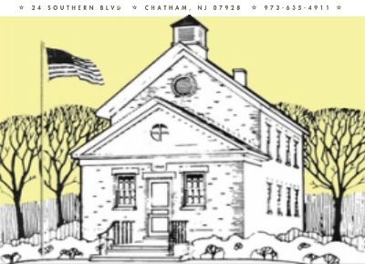

# Tour Chatham Township
 

<!--   <a href="https://apps.apple.com/us/app/tour-chatham-township/id1329535225"> -->
  <a href="https://apple.co/3DhnHgv">
<!--      -->
    
  </a>
  

    Tour Chatham Township is an iOS app developed for the Chatham Township Historical Society in order to use modern technology to help preserve and share the history of the local towns.
    Explore the historic sites and roadways of Chatham Township, Madison, and Green Village, NJ, while listening to the history behind them with the Chatham Township Historical Society’s driving tour! As you drive through 15 marked historic sites, you will uncover the hidden tales of the past while discovering the charm of your local town on this unforgettable audio-guided driving tour.
  

<!--  -->
<!--  -->
<!--  -->
<!-- <iframe class="imgur-embed" width="100%" height="1280" frameborder="0" src="https://i.imgur.com/wrucoP8.gifv#embed"></iframe> -->

## Features
- [x] Feature 1
- [x] Feature 2
- [x] Feature 3
- [x] Feature 4
- [x] Feature 5

## Requirements
- Xcode 14.1
- A device running iOS 12.0+

## Installation
#### For Use
1. [Download from the Apple App Store on any device iOS 12+](https://apps.apple.com/us/app/tour-chatham-township/id1329535225)

#### For Development
1. Please contact the developer for assistance setting up your development environment 

## Contact 
Anthony Tesoriero – atesoriero2000@gmail.com - www.aptesoriero.com - [GitHub](https://github.com/atesoriero2000/)

Distributed under the Apache 2.0 license. See [``LICENSE``](LICENSE) for more information.
